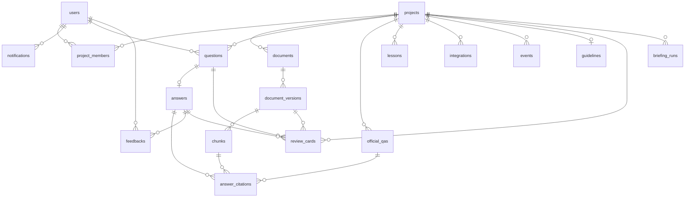
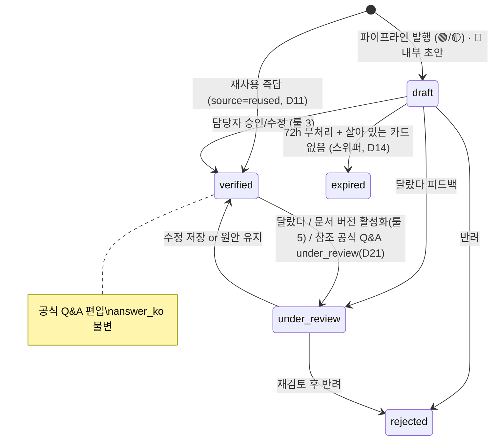
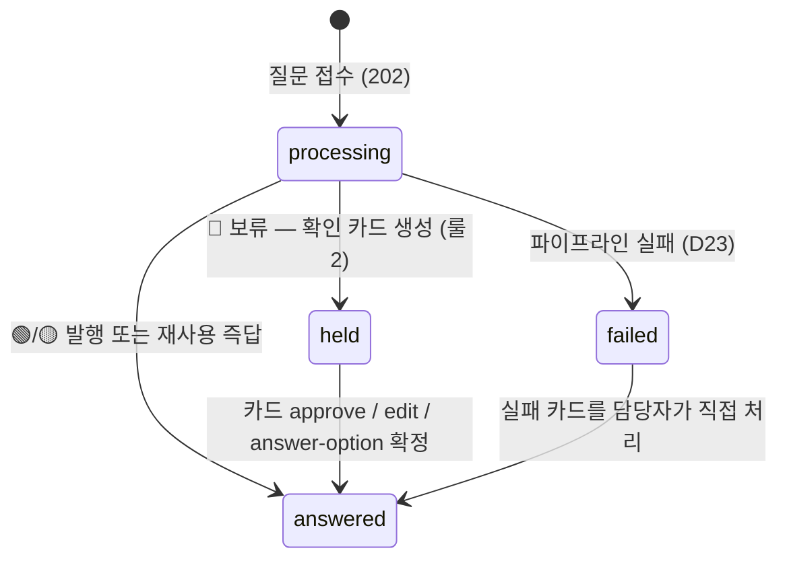

# 04. 데이터 모델

> 모든 PK는 UUID. 모든 테이블에 `created_at`(기본), 갱신되는 테이블에 `updated_at`.
> 벡터 컬럼은 `vector(1536)` **리터럴 고정** — 마이그레이션·모델에 상수로 박는다.
> `EMBEDDING_DIM` env는 (a) 임베딩 응답 차원 검증, (b) OpenAI `dimensions` 파라미터 전달용이며
> **컬럼 차원을 바꾸는 스위치가 아니다**. 기동 시 `EMBEDDING_DIM != 1536`이면 **fail-fast**.

## 1. ERD



- `projects ||--o| guidelines` — **0 또는 1**. 신규 프로젝트는 `guidelines` 행이 없으며, 최초 저장 시 생성된다(upsert).
- `questions ||--o| answers` — 질문당 답변 **최대 1행**(`UNIQUE(question_id)`, §7). MVP는 답변 재생성 API를 제공하지 않는다.
- `answers ↔ official_qas` — **순환 FK다.** `answers.official_qa_id`·`answers.similar_official_qa_id`가 `official_qas`를 가리키고, `official_qas.source_answer_id`가 `answers`를 되짚는다. 마이그레이션은 `answers` → `official_qas` 순으로 만든 뒤 앞의 두 FK를 `ALTER`로 붙이고, 모델은 `use_alter=True`를 단다(없으면 `Base.metadata.create_all`이 `CircularDependencyError`로 죽어 테스트가 통째로 멈춘다).
- `review_cards`는 `project_id`(인박스 조회 키) · `question_id`(필수) · `answer_id`(NULL 가능) · `document_version_id`(NULL 가능)를 함께 참조한다.

## 2. 테이블 정의

### users
| 컬럼 | 타입 | 설명 |
| --- | --- | --- |
| id | uuid PK | |
| email | text UNIQUE | 로그인 ID |
| password_hash | text | argon2 |
| name | text | |
| language | text | `ko` \| `en` |
| timezone | text | IANA (예: `Asia/Seoul`) |

### projects
| 컬럼 | 타입 | 설명 |
| --- | --- | --- |
| id | uuid PK | |
| name / description | text | |
| invite_code | text UNIQUE | 참여용, 재발급 가능 |
| answerer_id | uuid FK users | **담당자 1명** (생성자 기본, 6.3으로 교체) |
| away_mode | bool | 퇴근 모드 (기본 false) |
| settings | jsonb | 아래 §3 설정 스키마 |

### guidelines (프로젝트당 1행)
| project_id | uuid PK FK | |
| content | text | 응답 지침 (기능 1.3) |
| updated_by | uuid FK users | |

### project_members
| id | uuid PK | |
| project_id / user_id | uuid FK | UNIQUE(project_id, user_id) |
| role | text | `answerer` \| `asker` |
| status | text | `active` \| `left` |
| joined_at | timestamptz | |

### documents
| id | uuid PK | |
| project_id | uuid FK | |
| title | text | |
| source_type | text | `upload` \| `notion` \| `github` |
| source_ref | text NULL | notion page_id / github `owner/repo:path` |
| status | text | `active` \| `deleted` (soft delete) |

### document_versions
| id | uuid PK | |
| document_id | uuid FK | |
| version_no | int | 문서 내 1부터 증가 |
| original_filename / mime | text | |
| storage_path | text | `STORAGE_DIR` 상대 경로 |
| is_active | bool | 검색 대상 여부 — 문서당 활성 1개 |
| ingest_status | text | `pending` \| `processing` \| `ready` \| `failed` |
| ingest_error | text NULL | |
| uploaded_by | uuid FK users | |

### chunks
| id | uuid PK | |
| document_version_id | uuid FK | |
| seq | int | 버전 내 순서 |
| content | text | 원문(영어) 그대로 |
| meta | jsonb | `{heading_path, page_no}` |
| embedding | **vector(1536)** | HNSW 인덱스. 차원은 리터럴 고정(문서 상단) |

### questions
| id | uuid PK | |
| project_id / asker_id | uuid FK | |
| content_ko | text | 원문 |
| content_en | text NULL | 번역문 (파이프라인이 채움) |
| urgency | text | `normal` \| `urgent` (질문자 지정) |
| suggest_urgent | bool | AI 제안 플래그 (D10) |
| status | text | `processing` \| `answered` \| `held` \| `failed` |

### answers
| id | uuid PK | |
| question_id | uuid FK | **UNIQUE** — 질문당 최대 1행. MVP는 답변 재생성 API 미제공 (§7) |
| grade | text | `green` \| `yellow` \| `red` |
| matching_rate / search_score / grounding_score | int | 0~100. reused면 NULL 허용 |
| sim_raw | float NULL | **리스케일 전 원시 코사인 유사도(top-1)**. 실측 기록·캘리브레이션 근거 |
| held_reason | text NULL | 🔴 보류 사유 — `conflict` \| `no_evidence` \| `low_confidence` \| `schema_failed` \| `quota_exceeded` |
| question_struct | jsonb NULL | M3에서 저장하는 영어 구조화 `{background, question, options[]}`. M4에서 카드로 복사 |
| state | text | `draft` \| `verified` \| `under_review` \| `expired` \| `rejected` |
| content_ko / content_en | text | 🔴은 발행 안 하지만 내부 초안 보관(카드 표시용) |
| source | text | `generated` \| `reused` |
| official_qa_id | uuid FK NULL | reused 원본 / 확정 시 편입된 Q&A |
| similar_official_qa_id | uuid FK NULL | `similar_threshold`~`reuse_threshold` 구간에서 첨부된 "비슷한 확정 답변" (룰 4·D24). `05 §6` 의 `similar_official_qa` 가 여기서 나온다 |
| degraded_from_red | bool | DND 강등 여부 (룰 6) |
| expires_at | timestamptz NULL | draft 생성 +`draft_expire_hours`(72h). **재사용 답변은 NULL** (D11) |
| verified_at / verified_by | | 확정 정보 |

### answer_citations
| id | uuid PK | |
| answer_id | uuid FK | |
| chunk_id | uuid FK NULL | 문서 근거 |
| official_qa_id | uuid FK NULL | 공식 Q&A 근거 — **D24 이후 미사용. 항상 NULL** (`05 §6` `citations[]` 스키마에 대응 필드가 없다) |
| quote | text | 인용 원문 스니펫 |
| similarity | float | |

### feedbacks (크로스체크)
| id | uuid PK | |
| answer_id / user_id | uuid FK | |
| verdict | text | `correct`(맞았다) \| `different`(달랐다) |
| note | text NULL | 달랐다 사유 한 줄 |
| resolved | bool | 담당자 처리 시 true (룰 9) |

### review_cards (확인 카드 = 담당자 인박스)
| id | uuid PK | |
| project_id / question_id | uuid FK | |
| answer_id | uuid FK NULL | `reason='failed'`이면 NULL (D23) |
| reason | text | `green` \| `yellow` \| `red` \| `feedback` \| `doc_update` \| `failed` |
| document_version_id | uuid FK NULL | `reason='doc_update'`일 때 **새로 활성화된 버전**(재검토를 유발한 쪽). 그 외 NULL |
| status | text | `pending` \| `deferred` \| `resolved` |
| resolution | text NULL | `approved` \| `edited` \| `rejected` \| `kept`(원안 유지/전체 유지) |
| question_struct | jsonb NULL | 영어 구조화 `{background, question, options[]}` (🔴 전달용, 룰 8). `answers.question_struct`에서 복사 |
| recommend_approve | bool | 맞았다 2건↑ 승인 추천 (룰 3) |
| is_urgent | bool | 즉시 알림 대상 여부 |
| first_viewed_at | timestamptz NULL | 카드 처리 시간 지표 시작점 |
| deferred_until / resolved_at | timestamptz | |

- `reason='green'`: 🟢 답변도 카드를 **큐에 적재**하되 **브리핑·알림 대상에서는 제외**한다. `correct` 피드백 2건 누적으로 `recommend_approve=true`가 될 때만 브리핑 최상단에 올라온다 (룰 3).
- `reason='failed'`: 파이프라인 실패 안전망 카드. `answer_id=NULL`, 초안 없음, 질문자에게는 `answer.failed` 알림 (D23).

### official_qas (공식 Q&A = 확정 지식)
| id | uuid PK | |
| project_id | uuid FK | |
| question_ko / question_en | text | |
| answer_ko | text | **확정 한국어 원문 — 불변** (룰 4·D5) |
| answer_en | text | |
| question_embedding | **vector(1536)** | 재사용 검색용, HNSW. 차원은 리터럴 고정(문서 상단) |
| source_answer_id | uuid FK | |
| status | text | `active` \| `under_review` \| `archived` — under_review 중 재사용 금지 (D7) |
| correct_count | int | 맞았다 누적 |
| reuse_count | int | 재질문 즉답률 원천 |

- **`archived` 전이 규칙**: (1) `DELETE /official-qas/{id}`(담당자 전용) 호출, (2) 원본 문서 soft delete 시 그 문서에서 파생된 Q&A 자동 archived (D20).
  `archived`는 **재사용 검색·유사 첨부 대상에서 완전 제외**되며 MVP에서는 되돌리지 않는다. 전이 시 `official_qa.archived` 이벤트를 기록한다(§5).
- `under_review` 전이 시, 이 Q&A를 `official_qa_id`로 참조하는 `source='reused'` 답변도 함께 `under_review`로 내려간다 (D21).

### lessons (교훈)
| id | uuid PK | |
| project_id | uuid FK | |
| content | text | 한 줄 원칙 |
| content_hash | text | 삭제 후 재생성 차단 (D8) |
| status | text | `candidate` \| `approved` \| `deleted` |
| needs_recheck | bool | 문서 갱신 시 true (룰 5) |
| source_answer_id | uuid FK | |
| last_used_at | timestamptz NULL | 30개 초과 정리 제안 기준 |

### notifications (인앱 알림함)
| id | uuid PK | |
| user_id / project_id | uuid FK | |
| type | text | §4 알림 타입 |
| title / body | text | 수신자 언어로 저장 |
| payload | jsonb | `{question_id, answer_id, card_id...}` 딥링크용 |
| deliver_after | timestamptz NULL | **NULL = 즉시 발송**, 값 = 그 시각(다음 브리핑) 이후 발송 — 비긴급 카드 알림 보류용 (룰 6) |
| read_at | timestamptz NULL | |

### events (이력 — 지표의 단일 원천)
| id | uuid PK | |
| project_id | uuid FK | |
| actor_id | uuid FK NULL | NULL = system |
| type | text | §5 이벤트 타입 |
| entity_type / entity_id | text / uuid | |
| payload | jsonb | §5의 타입별 payload. 등급 산출 이벤트는 `S_raw`·`S`·`G_raw`·`G_final`·`removed_sentences`를 전부 기록 |

### briefing_runs (브리핑 중복 발송 방지)
| id | uuid PK | |
| project_id | uuid FK | |
| run_date | date | 담당자 `users.timezone` 기준 발송 대상 날짜 |
| sent_at | timestamptz | 실제 발송 시각 |

- 단일 프로세스 전제(`--workers 1`)에서도 재시작·수동 트리거로 중복 발송이 가능하다. **락이 아니라 제약으로 막는다**:
  `UNIQUE(project_id, run_date)` + `INSERT … ON CONFLICT DO NOTHING` → `rowcount == 1`일 때만 실제 발송한다 (결정 1.11, `03 §6`).

### integrations
| id | uuid PK | |
| project_id | uuid FK | |
| provider | text | `notion` \| `github` |
| config | jsonb | 토큰은 Fernet 암호화 문자열로 저장 |
| last_synced_at | timestamptz NULL | |
| last_sync_status | text NULL | `ok` \| `failed` + 에러 메시지 payload |

## 3. projects.settings 스키마 (기본값)

```json
{
  "green_threshold": 80,
  "yellow_threshold": 50,
  "grounding_min": 60,
  "s_floor": 0.25,
  "s_ceil": 0.679,
  "similarity_floor": 0.423,
  "reuse_threshold": 0.925,
  "similar_threshold": 0.855,
  "draft_expire_hours": 72,
  "max_lessons": 30,
  "retrieval_top_k": 6,
  "daily_llm_call_limit": 500,
  "saved_wait_assumption_hours": 24,
  "briefing_hour": 9,
  "dnd_start": "22:00",
  "dnd_end": "07:00"
}
```
- 룰 1의 "코드에 박지 말 것" 대상 전부 포함. PATCH settings로 부분 갱신 (기능 1.4).
- **유사도 리스케일** — `s_floor`/`s_ceil`은 원시 코사인을 0~100 등급 스케일로 옮기는 변환의 양 끝점이다:
  `S = round(clamp((sim_raw - s_floor) / (s_ceil - s_floor), 0, 1) × 100)`.
  `text-embedding-3-small`의 코사인 분포(평균 ≈0.43)를 흡수하므로 `green_threshold`/`yellow_threshold`(80/50)는 그대로 유지된다.
- `similarity_floor`: top-1 `sim_raw`가 이 값 미만이면 근거 없음으로 보고 **강제 🔴 `no_evidence`**. M-1 실측 전까지는 `s_floor` 파생값이었으나, **판정 4에서 독립 값으로 확정됐다** — 무근거 질문(Q9 0.3645)이 🟢 대역 하단(Q5 0.4811)보다 낮아 유사도만으로 분리 가능함이 실측됐고, 두 값의 중간인 **0.423**을 채택했다. 이 값이 Q8(0.4202)·Q9(0.3645)를 유사도만으로 차단하면서 🟢 대역은 전부 통과시킨다.
- `reuse_threshold` / `similar_threshold`는 **리스케일하지 않은 원시 코사인**에 적용한다. 재사용 답변은 `matching_rate: null`이라 화면에 %가 뜨지 않으므로 표기 모순이 없다.
- 위 임계값 5종은 **M-1 게이트 실측 확정값**이다 (**실측 2026-08-07**). 판정 표 원문은 `calibration-2026-08-07.txt`(1차 시도는 `-r1-q3-mismatch.txt`)에 보존돼 있다.
  - `s_ceil` **0.679** — 스크립트 제안(관측 상위 10% 지점) 그대로.
  - `s_floor` **0.25** — 손 조정값이다. 스크립트 자동 제안은 `min(전체 관측) − 0.02`인데 그 최소값이 **강제 🔴 대상인 Q9(0.3645)**여서 0.344가 나왔고, 그 구간에서는 🟢 대역 하단(Q3 43·Q5 41)이 RED로 떨어졌다. 🟢 대역 최소(Q5 0.4811)가 🟡을 유지하는 상한은 `2×0.4811 − 0.679 = 0.283`이며, 여기서 마진 0.03을 뺀 값이다. 결과: 🟢 대역 54~100, 강제 🔴 대상 27~40, 간격 +14.
  - ⚠️ **임계값으로 강제 🔴을 만들려 하지 말 것.** 리스케일은 원시 유사도에 단조이므로 Q3를 올리면 Q8·Q9도 반드시 함께 올라간다. 강제 🔴 4종은 `similarity_floor`와 ④의 `conflict`/`not_answerable` 플래그가 담당한다.
- `daily_llm_call_limit`: 프로젝트 일일 LLM 호출 상한. 초과 시 강제 🔴 `quota_exceeded`. **env가 아닌 settings**에 둔다(룰 1 일관성).
- `saved_wait_assumption_hours`: 절약 대기시간 지표(§5)의 가정치. 화면에 "가정치"로 표기된다.
- **`briefing_timezone`은 두지 않는다.** 브리핑·DND 시각 판정의 단일 원천은 항상 현재 담당자(`projects.answerer_id`)의 `users.timezone`이며, 담당자 교체 시 자동으로 따라간다. `05 §8` 응답의 `timezone`은 여기서 나오는 **파생값**이다.

## 4. 알림 타입

| type | 수신자 | 시점 |
| --- | --- | --- |
| `answer.completed` | 질문자 | 파이프라인 완료 (🟢/🟡 발행, 🔴 보류 안내) |
| `answer.failed` | 질문자 | **파이프라인 실패** — 답변 없이 담당자 카드로 전달되었음을 안내 (D23) |
| `answer.verified` | 질문자 | 승인 확정 |
| `answer.corrected` | 질문자+담당자 | 수정 확정 (양쪽 언어, 룰 8) |
| `answer.kept` | 질문자 | 원안 유지 + 사유 |
| `answer.rejected` | 질문자 | 반려 + 사유 |
| `card.created` | 담당자 | urgent만 즉시, 나머지는 `deliver_after`=다음 브리핑 시각 (룰 6). **`reason='green'` 카드는 알림 대상이 아니다** — 큐에만 적재된다 |
| `briefing.ready` | 담당자 | 브리핑 시각 배치 |
| `doc.review_needed` | 담당자 | 새 버전 활성화, "확정 답변 N건 재검토" (룰 5) |
| `feedback.different` | 담당자 | 달랐다 접수 (urgent 준하여 브리핑 기본) |
| `sync.completed` / `sync.failed` | 담당자 | 연동 동기화 결과 |

## 5. 이벤트 타입 (지표 매핑)

`question.created` `question.status_changed`(payload: from, to) `question.graded`(payload: grade, matching_rate, elapsed_ms) `answer.published` `answer.reused` `answer.reuse_missed`(payload: best_similarity) `answer.expired` `feedback.created`(verdict) `card.created` `card.viewed` `card.approved` `card.edited` `card.rejected` `card.deferred` `card.kept`(payload: bulk) `official_qa.created` `official_qa.suspended` `official_qa.archived` `lesson.candidate` `lesson.approved` `lesson.deleted` `document.version_activated` `answers.review_cascade`(payload: count) `member.joined` `answerer.transferred` `sync.run`

- `answer.reuse_missed`: 재사용 후보를 찾았으나 임계값 미달(또는 LLM 동일성 게이트 `no`)로 재사용하지 않고 새로 생성한 경우. **재질문 즉답률의 분모**를 만든다 (D26).
- `question.status_changed`: §6.1의 모든 전이에서 발행. `held → answered`(카드 확정) 추적의 단일 원천.
- `answer-option` 확정은 `05 §7.2`에 따라 `edit`과 동일 처리이므로 `card.edited`(payload에 `selected_option_index`)로 기록한다.
- **등급 산출 증적**: `question.graded`의 `payload`에는 `S_raw`(= `sim_raw`) · `S`(리스케일 후) · `G_raw`(프루닝 전) · `G_final` · `removed_sentences`(무근거로 제거된 문장)를 **전부 기록**한다. 환각 방어 2겹의 증적이며 캘리브레이션 재산출 근거다.

| 지표 | 계산 |
| --- | --- |
| 자동응답률 | `question.graded`에서 grade in (green, yellow) 비율 |
| 정정률 | `feedback.created` 중 different 비율 |
| 실측 정확도 (등급별) | 등급별 `(verified 또는 correct 피드백 ≥1건) / 해당 등급 전체 발행 수`. **표본 30 미만이면 값 대신 "표본 부족" 표기** (D25) |
| 카드 처리 시간 | `card.viewed` → `card.*` 액션까지 30초 내 비율 |
| 재질문 즉답률 | `answer.reused` / (`answer.reused` + `answer.reuse_missed`) (D26) |
| 절약 대기시간(데모용) | 🟢+🟡 질문 수 × `settings.saved_wait_assumption_hours`(기본 24h, **가정치**) |

## 6. 답변 상태 전이


- 🔴 답변은 발행되지 않고 `answers` 행은 draft로 남아 카드에서만 노출. 승인·수정 시 verified로 직행.
- **재사용 답변**(`source='reused'`)은 draft를 거치지 않고 곧바로 `verified`로 진입한다. `expires_at=NULL`, 카드 미생성, 만료 스위퍼 대상 아님 (D11).
- **피드백 허용 상태**는 `draft`·`verified`뿐이다. `expired`·`rejected`·`under_review`에 대한 피드백은 409 `FEEDBACK_NOT_ALLOWED` (D12).
- **`expired`는 종착 상태**다. 만료 답변에 대한 카드 확정 시도는 409로 거부한다 (D13).
  단 스위퍼가 `draft && expires_at < now && 연결된 review_cards 중 pending/deferred 없음`을 모두 만족할 때만 동작하므로(D14),
  **살아 있는 카드 밑의 답변은 만료되지 않는다** — 담당자가 72h 이후에 지연(deferred) 카드를 처리해도 그 답변은 여전히 `draft`이며 `draft → verified`로 확정된다.

## 6.1 질문 상태 전이



| 전이 | 트리거 | 부수 효과 |
| --- | --- | --- |
| `processing → answered` | 🟢/🟡 발행, 또는 재사용 즉답 | `answer.completed` 알림, `question.graded` 이벤트 |
| `processing → held` | 강제 🔴(충돌·근거없음·스키마실패·한도초과) 또는 매칭률 미달 | `answers.held_reason` 기록, `review_cards(reason='red')` 생성 |
| `processing → failed` | 파이프라인 예외·데드라인 초과 후 복구 실패, 좀비 회수 잡(`03 §2`) | `review_cards(reason='failed', answer_id=NULL)` 생성, `answer.failed` 알림 (D23) |
| `held → answered` | 담당자가 카드를 **approve / edit / answer-option** 중 하나로 확정 | `answer` 객체가 채워지고 질문 화면에 답변이 노출된다. `held_info`는 이력용으로 유지하되 `card_status`를 `resolved`로 갱신 (`05 §6`) |
| `failed → answered` | 담당자가 실패 카드에 직접 답변 작성 | **재처리(파이프라인 재실행) API는 MVP 미지원** — 해소 경로는 카드뿐이다 |

- `reject`로 해소되면 `status`는 `held`를 유지하고 `held_info.card_status`만 `resolved`가 된다. `answer.state`는 `rejected`이며 질문자 화면에 답변을 노출하지 않는다 (`05 §6`·`05 §7.1`).
- 모든 전이는 `question.status_changed`(payload: `from`, `to`) 이벤트를 발행한다 (§5).
- `answered`·`failed`에서 되돌아가는 전이는 없다. 답변 재생성 API가 없으므로(`answers`의 `UNIQUE(question_id)`) 질문 하나의 종착은 `answered` 또는 `failed`다.

## 7. 인덱스·제약

- `chunks.embedding`, `official_qas.question_embedding`: `USING hnsw (embedding vector_cosine_ops)`
  - 검색은 항상 **`1 - (embedding <=> :q)`** 로 유사도를 만든다. `<=>`는 **거리**이며, SQLAlchemy 헬퍼명이 `cosine_distance()`인 점에 주의(이름만 보고 유사도로 오해하기 쉽다).
  - HNSW post-filtering 대응: 검색 트랜잭션에서 `SET LOCAL hnsw.iterative_scan='relaxed_order'; SET LOCAL hnsw.ef_search=100;` — **pgvector 0.8.0 이상** 필요. 로컬 이미지와 배포 DB 양쪽에서 `SELECT extversion FROM pg_extension WHERE extname='vector'`로 확인한다.
  - 근거 검색(`06 §2` ③)은 `chunks`만 대상으로 한다(D24). `official_qas.question_embedding`은 `06 §2` ②의 재사용·유사 첨부 판정에만 쓰며, **두 인덱스를 하나의 랭킹으로 병합하지 않는다.**
- `answers`: **UNIQUE `(question_id)`** — 질문당 1행. MVP는 답변 재생성 API를 제공하지 않는다(§6.1).
- `document_versions`: 부분 UNIQUE `(document_id) WHERE is_active` — 활성 버전 1개 강제
- `review_cards`: `(project_id, status)`, `events`: `(project_id, created_at)`, `notifications`: `(user_id, read_at)`
  - 브리핑 조회는 `notifications(user_id, deliver_after)`도 함께 탄다.
- `feedbacks`: **UNIQUE `(answer_id, user_id)`** — 유저당 1건. 재제출은 409이며 verdict 변경은 지원하지 않는다 (D12).
- `briefing_runs`: **UNIQUE `(project_id, run_date)`** — 브리핑 중복 발송 방지. `INSERT … ON CONFLICT DO NOTHING` 후 `rowcount == 1`일 때만 발송한다 (결정 1.11).
- `project_members`: `(project_id) WHERE role='answerer' AND status='active'` 부분 UNIQUE — 담당자 1명 강제 (룰 9)

> ### ⚠️ 부분 UNIQUE 인덱스 스왑 절차 (필독)
>
> **부분 UNIQUE 인덱스는 `DEFERRABLE`을 지원하지 않는다.** 제약 검사를 커밋 시점으로 미룰 수 없으므로,
> "기존 행을 내리고 새 행을 올리는" 전환은 **한 트랜잭션 안에서 반드시 2문으로, 아래 순서대로** 수행한다.
> 한 문장(단일 `UPDATE … CASE`)으로 스왑하려는 시도는 **금지**한다.
>
> ⚠️ **M-1 실측 (2026-08-07) — 단일 UPDATE는 "항상 실패"하지 않는다. 그래서 더 위험하다.**
> 로컬 pg16.14 · 로컬 pg18.4 · 배포 Railway pg18.4 **세 환경 모두 동일한 결과**였다.
>
> | 케이스 | 방향 | 결과 |
> | --- | --- | --- |
> | A | 활성 `id 1 → 2` (낮은→높은) | **성공** `UPDATE 2` |
> | B | 활성 `id 2 → 1` (높은→낮은) | **`23505` duplicate key** |
> | C | 10행 중 활성 `1 → 7` (낮은→높은) | **성공** `UPDATE 10` |
>
> 성패가 **행 처리 순서에 의존**한다. 기존 활성 행이 새 활성 행보다 먼저 처리되면 통과하고, 나중이면 터진다.
> 즉 개발 중 우연히 A·C 방향만 테스트하면 **초록으로 통과한 뒤 운영에서 간헐 실패**한다 — 항상 실패한다면
> 오히려 안전하다(즉시 발견되므로). 아래 2문 절차는 순서와 무관하게 항상 성공함이 같은 프로브에서 확인됐다.
> 실측 원문: `calibration-2026-08-07-sql.txt`.
>
> **활성 버전 교체** (`document_versions`)
> ```sql
> BEGIN;
> SELECT id FROM documents WHERE id = :doc_id FOR UPDATE;              -- ① 상위 행 잠금
> UPDATE document_versions SET is_active = false WHERE document_id = :doc_id;   -- ② 전부 내린다
> UPDATE document_versions SET is_active = true  WHERE id = :new_version_id;    -- ③ 하나만 올린다
> COMMIT;
> ```
>
> **담당자 교체** (`project_members`, D16)
> ```sql
> BEGIN;
> SELECT id FROM projects WHERE id = :project_id FOR UPDATE;           -- ① 상위 행 잠금
> UPDATE project_members SET role = 'asker'    WHERE project_id = :pid AND role = 'answerer';  -- ② 구담당자 강등
> UPDATE project_members SET role = 'answerer' WHERE project_id = :pid AND user_id = :new_id;  -- ③ 신담당자 승격
> UPDATE projects SET answerer_id = :new_id WHERE id = :pid;           -- ④ 같은 트랜잭션에서 갱신
> COMMIT;
> ```
>
> 동시 요청 경합은 ①의 `SELECT … FOR UPDATE`로 상위 행(`documents` / `projects`)을 먼저 잠가 **직렬화**한다.
> 구담당자는 `asker`로 강등되어 프로젝트에 남는다(D16). 담당자는 교체 없이 떠날 수 없으므로 담당자 부재 상태는 발생하지 않는다(D17).
