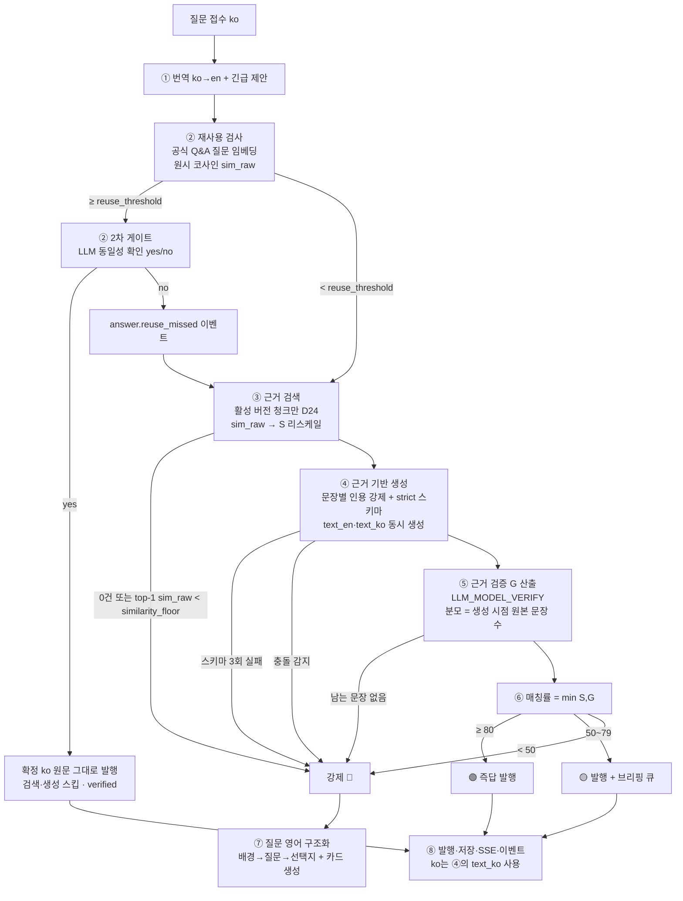

# 06. AI 파이프라인 명세

> 질문 접수부터 등급 확정까지의 전 과정. 모든 임계값은 `projects.settings`에서 로드한다.
> LLM 호출은 `services/llm/` 프로바이더 인터페이스 경유만 허용 (OpenAI 기본, fake 프로바이더로 테스트).

## 0. 전체 흐름



**성능 예산 — LLM 호출 횟수**

| 경로 | 순차 LLM 호출 | 횟수 |
| --- | --- | --- |
| 🟢/🟡 (기준) | ①번역 → ④생성 → ⑤검증 → ⑧ko번역 | **4회** |
| 🟢/🟡 (최적화 적용) | ①번역 → ④생성(`text_ko` 동시 생성) → ⑤검증 | **3회** — ⑧의 ko 번역 호출 제거 |
| 🔴 | ①번역 → ④생성 → ⑤검증 → ⑦구조화 | **4회** |
| 재사용 | ①번역 → ② 동일성 게이트 | 2회 |
| 최악 | ④ 스키마 재시도 2회 포함 | **6회** |

- **임베딩은 1회**다. ②에서 `content_en` 임베딩을 산출하고 ③에서 **그 벡터를 재사용**한다(질문은 동일하므로 다시 임베딩하지 않는다).
- ② 2차 게이트는 재사용 **후보가 있을 때만** 발생하는 추가 1회다(+약 2초).
- ⏱ **전체 지연 목표는 M-1 캘리브레이션 실측으로 확정됐다 (2026-08-07, n=8 반복 측정).** `LLM_REASONING_EFFORT=minimal`은 **지원된다**(400 아님).

  | 호출 방식 | 중앙 | p90 | 최대 | σ |
  | --- | --- | --- | --- | --- |
  | `responses.parse` minimal | 6.55s | 8.09s | 8.18s | **1.32** |
  | `chat.completions` minimal | 5.40s | 10.90s | 17.31s | 4.24 |

  **등급별 데드라인을 분리한다** — 단일 25초로는 🔴 경로가 성립하지 않는다:

  | 경로 | LLM 호출 | `responses` 중앙 / p90 | 데드라인 |
  | --- | --- | --- | --- |
  | 🟢/🟡 (①번역 ④생성 ⑤검증) | 3회 | 19.7s / **24.3s** | **25초** (`LLM_PIPELINE_DEADLINE_SECONDS`) |
  | 🔴 (①번역 ④생성 ⑤검증 ⑦구조화) | 4회 | 26.2s / 32.4s | **35초** (`LLM_PIPELINE_DEADLINE_RED_SECONDS`) |

  ⚠️ 기존의 "20초 이내"는 추론 모델 도입 전 수치이며 **폐기**한다. `00 §5`의 등급 확정 시간 목표도 이 표를 따른다.
  ⚠️ **호출 방식은 `responses.parse`로 고정한다.** `chat`이 중앙값은 빠르지만 σ=4.24로 튀어(최대 17.31s) **p90 기준 🟢/🟡 경로를 지키지 못한다**(32.7s). 데드라인 설계는 중앙값이 아니라 p90으로 한다. 실측 원문은 `calibration-2026-08-07-latency.txt`.

## 1. 인제스트 (문서 업로드 시, 비동기)

1. **파싱**: MD/TXT 그대로, PDF `pypdf`, DOCX `python-docx`. 실패 시 `ingest_status=failed` + 사유 저장.
2. **청킹**: 마크다운 헤딩 경로 우선 분할 → 800 토큰 초과 시 15% 오버랩 고정 분할. `meta`에 `heading_path`(예: `Refund Policy > Japan`)·`page_no` 저장.
3. **임베딩**: `EMBEDDING_MODEL` 배치 호출(100개 단위) → `chunks.embedding`. 컬럼 차원은 `vector(1536)` 리터럴 고정이며 응답 차원 불일치는 fail-fast (`04` 상단).
4. 완료 시 `ingest_status=ready`. **활성 전환 시** 구버전 근거 확정 답변 재검토 연쇄 (룰 5).

> 검색 시 유사도를 만드는 규약(`1 - (embedding <=> :q)`)은 §2 ③에 있다. 인제스트는 저장만 담당한다.

## 2. 단계별 상세

### ① 번역 + 긴급 제안 (LLM 1회)
- 입력: `content_ko`, 프로젝트 용어 힌트(응답 지침에서 추출된 고유명사).
- 출력(JSON): `{ "content_en": "...", "suggest_urgent": bool }` — 마감·장애·블로킹 표현 감지 시 true. **제안만** 하고 결정은 질문자 (D10).

### ② 재사용 검사 (임베딩 1회 + 벡터 검색 + 동일성 게이트)
- `content_en` 임베딩 → `official_qas` 중 `status=active` 대상 검색. **이 벡터를 ③에서 재사용한다.**
- 판정 기준은 **리스케일하지 않은 원시 코사인 `sim_raw`**다. S(리스케일 값)와 다른 축이므로 섞지 않는다 (룰 4).
  `reuse_threshold(0.925)` · `similar_threshold(0.855)`는 **M-1 게이트 실측 확정값**이다 (2026-08-07). 실측 Q8↔Q10 = 0.9551, 무관 질문쌍 최대 0.4764로 안전 여유 +0.4486이다.
- **1차 통과** `sim_raw ≥ reuse_threshold`: 재사용 **후보**로만 본다. 이것만으로 재사용하지 않는다.
- **2차 게이트 (LLM 동일성 확인, 1회)**: 후보 질문과 신규 질문을 함께 주고 *"이 두 질문은 같은 질문인가?"* 를 **yes/no로 1회** 묻는다. 단일 임계값에 재사용을 걸지 않기 위한 장치다.
  - `yes` → **검색·생성 전부 스킵.** `answer_ko`(확정 한국어 원문)를 **그대로** 발행(재번역 금지, D5). `source=reused`, `official_qa_id` 연결, `reuse_count++`, 이벤트 `answer.reused`.
  - `no` → 일반 생성 경로(③)로 내려보내고 **`answer.reuse_missed` 이벤트**를 남긴다(payload: `best_similarity`). 이 이벤트가 재질문 즉답률의 분모다 (D26).
- **재사용 답변의 상태 (D11)**: `state=verified` · `expires_at=NULL` · **확인 카드 미생성** · 만료 스위퍼 대상 아님. 등급은 🟢로 표기하되 `matching_rate`는 `null`("공식 확정 답변" 표기). `question.graded` 이벤트는 `grade=green, matching_rate=null, source=reused`로 발행한다.
- `similar_threshold ~ reuse_threshold` 구간: 계속 진행하되 응답에 `similar_official_qa`를 첨부한다. **공식 Q&A가 답변 근거로 노출되는 경로는 이것뿐이다** (D24).
- `under_review` · `archived` 상태 공식 Q&A는 재사용·유사 첨부 대상에서 제외 (D7).

### ③ 근거 검색

**대상 범위 (D24 — 축소 확정)**
- 검색 대상은 **`documents.status='active'` 문서의 활성 버전(`is_active`) 청크로 한정**한다. 프로젝트 외부 지식 금지.
- **`chunks`와 `official_qas`를 한 랭킹에 섞지 않는다.** 공식 Q&A는 ②의 `similar_official_qa` 첨부 경로로만 노출된다. 이유: 공식 Q&A는 본문 임베딩 컬럼(`question_embedding`만 존재)·EVIDENCE 포맷·citation 렌더링이 전부 미비하므로, 범위를 줄이는 것이 옳다는 확정 결정이다.
- soft delete된 문서의 청크는 물리 삭제하지 않되 검색에서 빠진다 (D20).

**유사도 산출**
```sql
-- ⚠️ pgvector의 <=> 는 "거리"다. SQLAlchemy 헬퍼명도 cosine_distance().
--    그대로 정렬·비교하면 등급이 정확히 뒤집힌다.
SELECT id, content, meta,
       1 - (embedding <=> :q) AS sim_raw
  FROM chunks
 WHERE document_version_id = ANY(:active_version_ids)
 ORDER BY embedding <=> :q          -- 거리 오름차순 = 유사도 내림차순
 LIMIT :retrieval_top_k;            -- retrieval_top_k = 6 (기본값, 8에서 하향)
```

**S 리스케일 (룰 1)**
```
S = round(clamp((sim_raw - s_floor) / (s_ceil - s_floor), 0, 1) × 100)
```
- `sim_raw`는 **top-1 청크의 원시 코사인 유사도**다. `answers.sim_raw`에 그대로 기록해 캘리브레이션 근거로 남긴다.
- `s_floor(0.25)` / `s_ceil(0.679)`는 `projects.settings` 값이며 **M-1 게이트 실측 확정값**이다 (2026-08-07, 도출 근거는 `04 §3`). 임베딩 모델마다 코사인 분포 중심이 다르므로(`text-embedding-3-small`은 평균 ≈0.43) 원시값을 그대로 100배 하면 🟢에 영원히 도달하지 못한다. 리스케일이 이 스케일 차이를 흡수하므로 **80/50 등급 임계값은 그대로 유지된다.**

**HNSW post-filtering 대응 (pgvector 0.8.0 이상 필요)**
```sql
SET LOCAL hnsw.iterative_scan = 'relaxed_order';
SET LOCAL hnsw.ef_search = 100;
```
- 검색 트랜잭션에서 위 두 줄을 먼저 실행한다. HNSW는 인덱스 스캔 **이후** `WHERE`를 적용하므로(post-filtering), 활성 버전 필터가 걸리면 top-k가 조용히 0건이 될 수 있다.
- **0건 처리 순서**: 결과 0건 → `iterative_scan`을 켠 상태로 **재조회 1회** → 그래도 0건일 때만 `no_evidence` 확정.
- 로컬 이미지와 배포 DB 양쪽에서 `SELECT extversion FROM pg_extension WHERE extname='vector'`로 0.8.0 이상을 확인한다 (M-1 게이트 항목).
  - ✅ **로컬·배포 양쪽 확인 완료 (2026-08-07)** — M-1 게이트 DoD 충족.

    | 환경 | pgvector | PostgreSQL | `CREATE EXTENSION vector` | `iterative_scan` |
    | --- | --- | --- | --- | --- |
    | 로컬 `pgvector/pgvector:pg18` | 0.8.6 | 18.4 | ✅ | ✅ `relaxed_order` |
    | 배포 Railway (TCP Proxy) | 0.8.6 | 18.4 | ✅ **권한 있음** | ✅ `relaxed_order` |

    `<=>`가 **거리**임을 양쪽에서 실증했다 — `same=0`, `orthogonal=1`. 유사도는 반드시 `1 - (embedding <=> :q)`.
    배포 DB에서 `vector(1536)` 컬럼 + HNSW 인덱스 생성까지 확인했다(M0 마이그레이션 예행). 원문: `calibration-2026-08-07-deploy-db.txt`.
  - ⚠️ **Railway는 `DATABASE_PUBLIC_URL`이 기본으로 없다.** Postgres 서비스 → Settings → Networking에서 **TCP Proxy를 켜야** 생성된다. 기본 `DATABASE_URL`은 내부망(`postgres.railway.internal`) 전용이라 외부에서 붙지 않는다.

**강제 🔴 조건**
- 재조회 후에도 결과 0건 → 강제 🔴 (`no_evidence`).
- **top-1 `sim_raw < similarity_floor`(기본 0.444 — M-1 은 0.423 이었고 2026-08-09 상향, `03 §4.1.3`)** → 청크가 반환되었더라도 근거 없음으로 보고 강제 🔴 (`no_evidence`). 벡터 검색은 항상 "가장 가까운 무언가"를 돌려주므로 하한이 없으면 무관한 청크로 답을 만들게 된다.

### ④ 근거 기반 생성 (LLM 1회, Structured Outputs strict)

**호출 방식 — 하나로 고정한다 (두 방식을 섞지 않는다)**
```python
# 표준: Responses API
resp = client.responses.parse(model=settings.LLM_MODEL_ANSWER,
                              input=[...], text_format=SentencesOut)

# 대안(Chat Completions를 쓸 경우에만):
# response_format={"type": "json_schema",
#                  "json_schema": {"name": "sentences_out", "strict": True, "schema": {...}}}
```

**strict 스키마 요건 (위반 시 400)**
- **모든 필드 required**, optional은 `Optional[X]`로 표현한다.
- 모든 object에 `additionalProperties: false` — Pydantic은 `model_config = ConfigDict(extra="forbid")`.
- ⛔ **기본값이 있는 필드 금지.** 기존 스키마의 `conflict_chunk_ids: []`가 **400의 직접 원인**이다. 빈 배열도 모델이 항상 채우게 하고 서버에서 기본값을 주지 않는다.
- 미지원 키워드(`minItems` / `uniqueItems` / `format` 일부 등)는 스키마에 넣지 말고 **Pydantic validator로 사후 검증**한다.

**출력 스키마**
```json
{
  "sentences": [
    { "text_en": "...", "text_ko": "...", "chunk_ids": ["ch-1"] }
  ],
  "not_answerable": false,
  "conflict": false,
  "conflict_chunk_ids": []
}
```
- **`text_ko`를 문장 단위로 함께 생성**한다 → ⑧의 ko 번역 LLM 호출이 제거되어 🟢/🟡 경로가 4회 → **3회**가 된다. 확정 원문 고정 규칙(D5)은 담당자 수정 경로에만 적용되므로 이 최적화와 충돌하지 않는다.
- `chunk_ids`는 **프롬프트 지역 별칭**(`"ch-1"`, `"ch-2"` …)을 쓴다. **UUID를 모델에 노출하지 않는다** — 모델이 UUID를 지어낼 여지를 없애고 토큰도 아낀다. 서버가 별칭↔UUID 매핑을 들고 있다가 `answer_citations` 저장 시 복원한다.
- **인용 id 실재 검증**: `[EVIDENCE]`에 없는 id는 **제거**하고, 그 결과 인용이 비게 된 문장은 **`supported=false`로 처리**한다(⑤의 입력으로 넘어간다). 환각 방어 1겹의 마지막 관문이다.

**시스템 프롬프트 골격**
```
You answer questions strictly from the provided evidence chunks.
Rules:
- Every sentence MUST cite at least one chunk id that supports it.
- If the evidence does not contain the answer, set not_answerable=true. Never use general knowledge.
- A chunk that merely mentions the topic without stating the requested fact does NOT count as
  evidence. In that case set not_answerable=true.
- If two chunks contradict each other on the asked point, set conflict=true and list both chunk ids.
- For each sentence, provide both text_en and its Korean translation text_ko.
- Follow the project guidelines below. Apply the approved lessons below.
[GUIDELINES] {guidelines.content}
[APPROVED LESSONS] {lessons: approved, 최신 30개} → last_used_at 갱신
[EVIDENCE] {top_k chunks: ch-N alias, doc_title, version, heading_path, content}
[QUESTION] {content_en}
```

**분기**
- 스키마 검증 실패 시 재시도 최대 2회 → 소진 시 강제 🔴 (`schema_failed`).
  > ⚠️ **strict 모드에서는 스키마 위반이 사실상 발생하지 않는다.** 실 API에서 `schema_failed`에 도달하는 경로는 **refusal**과 **max token 초과**뿐이다. 따라서 §5 테스트 6은 **FakeLLM 전용 경로**이며, 실 API 스모크에서 재현할 대상이 아니다.
- `not_answerable=true` → 강제 🔴 (`no_evidence`).
- `conflict=true` → 강제 🔴 (`conflict`, 충돌 근거 쌍을 카드에 표시).

### ⑤ 근거 검증 — G 산출 (LLM 1회, **생성과 분리된 모델 설정**)
- 호출 모델은 **`LLM_MODEL_VERIFY`** env를 쓴다. `LLM_MODEL_ANSWER`와 **다른 모델로 교체 가능**하게 분리해 둔 것이 환각 방어 2겹의 핵심이며, 예상 질문 *"매칭률 자기평가는 순환논리 아닌가?"* 에 대한 답변 근거다.
- 입력: 생성된 문장들 + 각 문장이 인용한 **청크 원문 전체**.
  - ⛔ **인용 청크를 잘라서 넘기지 않는다.** `QUOTE_MAX_LENGTH` 는 `05 §6` `citations[].quote`
    (화면 하이라이트 스니펫) 길이이지 검증 근거 길이가 아니다. 그것으로 자르면 ④ 는 청크
    전문을 보고 문장을 쓰는데 ⑤ 는 앞부분만 보고 판정하게 되어, 근거가 청크 뒤쪽에 있는
    문장이 통째로 무근거 처리된다 → `G=0` → 멀쩡한 답변이 `low_confidence` 🔴 로 떨어진다.
    배포본에서 실제로 발생했다 (`09 §7.5`).
- 문장별 판정: `supported: true|false` (인용 청크가 문장을 실제로 뒷받침하는가). 인용이 비어 있거나 ④에서 제거된 문장은 자동 false.
- 문장별 인용문: `quote` — 판정 근거가 된 **청크 원문의 구간을 그대로** 돌려받아 `05 §6` `citations[].quote` 로 저장한다. ⑤는 판정하려고 이미 근거를 찾은 상태이므로 **LLM 호출은 늘지 않는다**.
  - ⛔ **청크에 실재하는 부분 문자열일 때만 저장한다.** 지어낸 구간을 그대로 실으면 환각 방어(§7)가 뚫리고, 프론트가 원문에서 그 문자열을 찾아 하이라이트하므로(`05 §6`) 화면에서도 아무것도 칠해지지 않는다. 실재하지 않거나 빈 문자열이면 **청크 앞부분(`QUOTE_MAX_LENGTH`)으로 폴백**한다 — ⑤를 건너뛴 경로(데드라인 초과, §6)도 같다.
  - 인용은 **청크당 1행**이라 같은 청크를 두 문장이 인용하면 먼저 발행된 문장의 `quote`만 남는다. 문장별 인용을 화면에 내리려면 `answer_citations`에 문장 순번과 `05 §6` 계약 변경이 필요하다.
- **G 산출 — 분모 고정 (룰 1)**
  ```
  G = round(지지 문장 수 / 생성 시점 원본 문장 수 × 100)   # 분모는 어떤 경우에도 바뀌지 않는다
  ```
  - ⛔ **프루닝 후 재계산 금지.** 무근거 문장을 제거해도 분모는 줄지 않으므로 **프루닝은 매칭률을 올리지 못한다.** (예: 5문장 중 2문장만 supported → 프루닝 후에도 `G = 40`이지 100이 아니다.)
  - 이 고정이 없으면 프루닝이 항상 `G=100`을 만들어 `min(S,G)`의 G가 죽은 코드가 되고, 환각 60%짜리 답변이 🟢로 올라간다.
- **프루닝 규칙**: `G < grounding_min(60)`이면 unsupported 문장을 제거하고 남은 문장으로 **발행**한다. 이는 **발행 품질을 위한 조치일 뿐 매칭률과 무관**하다. 남는 문장이 0개면 🔴.
- **문장 수가 1~2개일 때는 `grounding_min`을 적용하지 않는다.** 비율 통계가 의미를 갖지 못하는 구간이므로 **전 문장이 supported여야 하며, 하나라도 무근거면 🔴**이다. `grounding_min`은 문장 3개 이상일 때만 쓴다.
- **증적 기록**: `question.graded` 이벤트의 `payload`에 `S_raw`(= `sim_raw`) · `S`(리스케일 후) · `G_raw`(프루닝 전) · `G_final` · `removed_sentences`를 **전부** 기록한다 (`04 §5`).

### ⑥ 매칭률·등급
- `matching_rate = min(S, G)`
- `≥ green_threshold(80)` → 🟢 / `≥ yellow_threshold(50)` → 🟡 / 미만 → 🔴(`held_reason='low_confidence'`)
- **DND 강등 규칙 (룰 6 + D2)**: 현재 담당자의 DND 시간대일 때, **`held_reason == 'low_confidence'`인 🔴만** 🟡로 강등 발행한다(`degraded_from_red=true`) + 브리핑 큐. 강등하더라도 **제거 후 남는 문장이 있을 때만** 가능하다(내보낼 추정 답변이 없으면 강등 대상이 없다).
- ⛔ **강제 🔴 4종(`conflict` / `no_evidence` / `schema_failed` / `quota_exceeded`)은 DND에서도 🔴을 유지한다.** 충돌 감지 결과나 근거 없음이 "몇 시에 물었는가"에 따라 조용히 은폐되는 것은 룰 2 위반보다 심각하다. 이 규칙 덕분에 **데모 Q7·Q8이 시연 시각과 무관하게 🔴로 재현**된다.
- **타임존 단일 원천**: DND·브리핑 시각 판정은 항상 현재 담당자(`projects.answerer_id`)의 **`users.timezone`**을 쓴다. `settings`에 별도 타임존 키를 두지 않는다(`briefing_timezone` 없음). 담당자가 교체되면 판정 기준도 자동으로 따라간다.

### ⑦ 🔴 질문 구조화 (LLM 1회)
- 출력: `{ "background": "...", "question": "...", "options": ["...", "..."] }` (영어, 룰 8 "배경→질문→선택지").
- background에는 검색된 근거 요약·충돌 지점·질문자 맥락 포함 — 담당자가 한 번에 답할 수 있게.
- 결과를 **`answers.question_struct`에 저장**하고 M4에서 `review_cards.question_struct`로 복사한다.
- 카드 생성: `reason='red'`, `held_reason`을 함께 표시. urgent면 즉시 알림(DND 제외), 아니면 브리핑 배치(`notifications.deliver_after`). **카드는 항상 즉시 큐에 적재** (인박스 안전망).

### ⑧ 발행
- 🟢/🟡: 문장 결합 → `text_en` 결합 = `content_en`, **`text_ko` 결합 = `content_ko`**. ⛔ **여기서 ko 번역 LLM을 호출하지 않는다** — ④가 이미 문장별 `text_ko`를 생성했다.
- `answers` 저장(`state=draft`, `expires_at = now + draft_expire_hours(72h)`) + `answer_citations` 저장(별칭→UUID 복원) + 질문자 알림·SSE + `question.graded` 이벤트(`elapsed_ms` 및 §2⑤의 증적 필드 포함).
- 🔴: 답변을 발행하지 않되 `answers` 행은 초안으로 남기고 **`answers.held_reason`에 사유를 저장**한다(`conflict` / `no_evidence` / `low_confidence` / `schema_failed` / `quota_exceeded`). 이 값이 `05`의 `held_info.reason`과 DND 강등 판정(⑥)의 입력이다.
- 확인 카드: 🟢은 `reason='green'`(큐에 적재하되 **브리핑·알림 제외**), 🟡은 `reason='yellow'`, 🔴은 `reason='red'`. **재사용 답변만 카드를 만들지 않는다** (D11).
- 응답에는 항상 `disclaimer`(참고용 표기) 포함 — 확정 전 상태 모델 (룰 3).

## 3. 확정·환류 루프

| 트리거 | 처리 |
| --- | --- |
| 카드 **승인** | answer `verified` → 공식 Q&A 편입(question ko/en + answer ko/en + 질문 임베딩) → 질문자 알림 |
| 카드 **수정** (`content_en` 입력) | en→ko 번역 → **ko를 확정 원문으로 고정** (D5) → 공식 Q&A 편입 → 정정 알림(양쪽 언어) → **교훈 후보 추출** |
| **담당자 직접 등록** (`05 §9` POST) | 편입 없이 공식 Q&A 생성 — 질문 번역은 ①과 같은 프롬프트, 임베딩은 ②와 같은 축(영어 번역문). `source_answer_id=NULL` |
| 카드 **원안 유지** | `verified` 복귀 + 유지 사유 알림 |
| 카드 **반려** | answer `rejected` + 사유 전달. 공식 Q&A 미편입 |
| 카드 확정 (공통) | 질문 `held → answered` 전이 + `question.status_changed` 이벤트 (`04 §6.1`) (reject 제외 — reject는 held 유지, `05 §6`) |
| **맞았다** | `feedbacks` 기록. `answer.official_qa_id`가 있으면 해당 **`official_qas.correct_count++`** (D22) |
| **맞았다 2건** | 카드 `recommend_approve=true` → 브리핑 최상단 (자동 확정 없음). 🟢 카드도 이때 비로소 브리핑에 등장한다 (룰 1) |
| **달랐다** | answer(및 연결된 공식 Q&A) `under_review` → 재사용 중단 → 카드 생성(`reason='feedback'`) |
| **공식 Q&A `under_review` 전환** | 그것을 `official_qa_id`로 참조하는 **`source='reused'` 답변도 함께 `under_review`** + 질문자 알림 (D21) |
| **문서 버전 활성화** | 해당 버전 근거 확정 답변·공식 Q&A `under_review` + 카드 묶음(`reason='doc_update'`, `document_version_id`=새로 활성화된 버전) + 교훈 `needs_recheck=true` |
| **문서 soft delete** | **버전 활성화와 동일한 재검토 연쇄**를 일으킨다 (D20). 파생된 공식 Q&A는 `archived` + `official_qa.archived` 이벤트. 해당 청크는 이후 ③ 검색에서 빠진다 |

### 교훈 추출 (수정 확정 시, LLM 1회)
```
입력: 원답(en) vs 수정답(en) + 질문
출력: { "lesson": "Japan region has a 20-day refund window due to local law, not 30." } (재사용 가능한 일반 원칙 한 줄)
```
- `content_hash` = sha256(정규화된 lesson). 삭제된 교훈 해시와 일치하면 후보 생성 스킵 (D8).
- 후보는 담당자 승인 후에만 ④ 프롬프트에 주입. 승인 교훈 30개 초과 시 정리 제안만.

## 4. 스케줄러 잡

| 잡 | 주기 | 동작 |
| --- | --- | --- |
| 만료 스위퍼 | 10분 | `state='draft'` && `expires_at < now()` && **연결된 `review_cards` 중 `status ∈ {pending, deferred}`인 것이 없을 것** → `expired` + 이벤트. **살아 있는 카드 밑에서 답변을 죽이지 않는다** (D14). 재사용 답변은 `expires_at=NULL`이므로 애초에 대상이 아니다 (D11) |
| **좀비 회수** | 5분 | `questions.status='processing' AND created_at < now() - interval '5 minutes'` → `status='failed'` + **`review_cards(reason='failed', answer_id=NULL, draft_answer=null)`** 생성 + `answer.failed` 알림. 프로세스가 죽어 `except`조차 타지 못한 경우의 안전망 (D23, `03 §2`) |
| 아침 브리핑 | 매 정시 체크 | 프로젝트별 `briefing_hour` 도달 시(**담당자 `users.timezone` 기준**) 브리핑 알림 + `briefing.ready` SSE. **중복 발송은 락이 아니라 제약으로 막는다**: `INSERT INTO briefing_runs (project_id, run_date) … ON CONFLICT DO NOTHING` → **`rowcount == 1`일 때만 발송** (`04 §7`) |
| 브리핑 보류 알림 flush | 브리핑 발송 시 | `notifications.deliver_after <= now()`인 보류 알림 일괄 발행. `reason='green'` 카드는 대상에서 제외 (룰 1) |

## 5. 테스트 전략 (FakeLLMProvider)

- `fake_provider.py`는 입력 프롬프트의 마커(질문 키워드)에 따라 **결정적 출력**을 반환 — 파이프라인 테스트가 네트워크 없이 돈다.
- 필수 테스트 케이스 (**1~7이 M3 DoD**, 8은 M6 범위):
  1. **리스케일 + `min(S,G)`**: 동일한 `sim_raw`에 대해 `S = round(clamp((sim_raw - s_floor)/(s_ceil - s_floor),0,1) × 100)`가 나오는지, 그리고 S 높음·G 높음 → 🟢 / **S 높음·G 낮음 → `min` 규칙으로 강등**되는지 (룰 1의 존재 이유)
  2. **G 분모 고정**: 5문장 중 2문장만 supported → 프루닝 후 3문장을 지워도 **`G_final = 40`**이며 `G=100`이 되지 않는다. 매칭률이 프루닝으로 올라가지 않음을 단언한다. 남는 문장 0개면 🔴. 문장 1~2개일 때는 `grounding_min` 미적용(하나라도 무근거면 🔴)
  3. `conflict` → 강제 🔴 + `answers.question_struct` 생성 → 카드 복사
  4. **재사용 경계값**: `reuse_threshold`를 **캘리브레이션 산출값**으로 두고 **±0.002** 지점을 검증(미만이면 생성 경로 + `answer.reuse_missed`, 이상이면 2차 게이트 진입). 하드코딩 0.919/0.921 금지 — 산출값이 바뀌면 함께 움직여야 한다
  5. **DND 분기**: `low_confidence` + 발행 문장 있음 → 🟡 강등 / 문장 없음 → 🔴 유지 / **강제 🔴 4종은 DND에서도 🔴 유지**
  6. 스키마 실패 3회 → 🔴 `schema_failed` — ⚠️ **FakeLLM 전용 경로**. 실 API strict 모드에서는 refusal·max token 초과가 아니면 도달하지 않는다(§2 ④)
  7. **만료 답변의 카드 처리 시도 → 409** (D13). 만료는 "확정 불가 + 상태 표기"이므로 승인·수정 대상에서 제외된다. 재사용 풀은 원래 공식 Q&A뿐이라 "만료 답변 재사용 금지" 로직은 존재하지 않는다
  8. 삭제 교훈 재생성 차단 (**M6 범위** — M3 DoD 아님)
- 실LLM 스모크 1회(M3 DoD): strict 스키마가 실제로 400 없이 통과하는지, `reasoning_effort=minimal`에서 지연이 데드라인 안인지 확인.

> ### ⚠️ FakeLLM의 한계 (반드시 인지)
> `FakeLLMProvider`의 임베딩은 **해시 기반 결정적 벡터**다. 실제 의미 유사도를 반영하지 않으므로 이 벡터들 사이의 코사인 값은 **무의미하다.**
> 따라서 위 테스트들은 파이프라인의 **분기 로직**은 검증하지만 **캘리브레이션 결함(임계값이 실제 분포와 맞지 않는 문제)은 원리적으로 검출하지 못한다.**
> 테스트가 전부 초록인데 실 데이터에서 🟢이 한 건도 안 나오는 상황이 여기서 나온다. **그 역할은 M-1 캘리브레이션 게이트(`07`)가 담당한다** — 테스트로 대체하지 않는다.

## 6. 비용·지연 가드

- **예약 작업은 전부 상태 파생형이다** (2026-08-11). 만료는 `expires_at < now`, 좀비는
  `processing` 정체, 브리핑은 `briefing_hour 도달 + 오늘 실행 없음` — 무엇을 할지가 DB
  상태에서 매번 다시 계산되므로 **다운타임 이후 자동으로 소급된다.** 할 일을 쌓아 두는
  큐가 필요 없는 이유다. 대신 **한 일**을 `job_runs` 에 남긴다(`04 §6.3`).
  - 기동 직후 세 잡을 1회씩 돌린다 — `interval` 첫 발화가 "기동 + 주기"라 재배포마다
    최대 60분 공백이 생겼다.
  - 브리핑만 `cron`(매 정시)이다. `interval` 이면 기동 시각에 따라 확인 시각이 밀린다.
  - ⛔ **날짜를 넘긴 다운타임의 브리핑은 보내지 않는다.** 하루 지난 인박스 요약은 정보
    가치가 없고 `_is_catch_up_inside_dnd` 와 충돌한다. 기록만 남긴다.
- **일일 호출 상한**: `settings.daily_llm_call_limit`(기본 500) — ⚠️ **env가 아니라 `projects.settings`**다(룰 1의 하드코딩 금지 원칙). 초과 시 질문 접수는 받되 강제 🔴 + `held_reason='quota_exceeded'`.
- **타임아웃**: `LLM_TIMEOUT_SECONDS=45`, 재시도 1회. 15초는 추론 모델에 비현실적이다.
- **파이프라인 데드라인**: 🟢/🟡 경로 `LLM_PIPELINE_DEADLINE_SECONDS=25`, 🔴 경로 `LLM_PIPELINE_DEADLINE_RED_SECONDS=35` (M-1 실측 근거는 §0). 초과 시 **그 시점까지의 결과로 🟡 발행 + 카드 생성**(안전망). 결과가 아예 없으면 `status='failed'` + `reason='failed'` 카드 (D23).
- ⛔ **금지 파라미터**: `temperature` / `top_p` / `presence_penalty` / `frequency_penalty` / `seed` — GPT-5 계열에 전달하면 **400**이다. 프로바이더 계층에서 **화이트리스트로 강제**하고 그 외 키는 드롭한다.
- `max_tokens` → **`max_completion_tokens`**를 쓴다.
- `LLM_REASONING_EFFORT=minimal` — 지연 예산 달성의 필수 조건. M-1에서 모델의 지원 여부와 실측 지연을 함께 확정한다.
- 파이프라인 총 실패 시 `questions.status='failed'` + 질문자 `answer.failed` 알림. 질문은 카드로 담당자에게 전달된다 = 안전망.

## 7. 환각 방어 4겹

> 발표 슬라이드가 그대로 인용하는 정본. "4겹"은 아래 표를 가리킨다.

| 겹 | 단계 | 방어 방식 | 증적 필드 |
| --- | --- | --- | --- |
| **1** | 생성 차단 | 문장별 인용 강제 + strict 스키마 + **인용 id 실재 검증**(EVIDENCE에 없는 id 제거 → 해당 문장 `supported=false`) | `answer_citations` |
| **2** | 발화 전 검증 | **`LLM_MODEL_VERIFY`(생성과 분리된 호출)**로 문장별 supported 판정, 무근거 문장 제거 | `events.payload.removed_sentences`, `G_raw` / `G_final` |
| **3** | 등급 필터 | `min(S, G)` + 강제 🔴 4종(충돌 / 근거없음 / 스키마실패 / 한도초과) | `answers.matching_rate`, `answers.held_reason` |
| **4** | 사후 검증 | 담당자 확정 + 질문자 크로스체크("맞았다/달랐다") + **등급별 실측 정확도 표기** | `feedbacks`, `metrics.grade_accuracy` |

- 2겹의 핵심은 **모델 분리 가능성**이다. `LLM_MODEL_VERIFY`를 env로 빼 두었으므로 생성과 다른 모델로 교체할 수 있다 → 예상 질문 *"매칭률 자기평가는 순환논리 아닌가?"* 에 대한 최강 답변.
- 3겹은 **DND에서도 뚫리지 않는다.** 강제 🔴 4종은 시간대와 무관하게 🔴을 유지한다(§2 ⑥).
- 4겹의 `grade_accuracy`는 **표본 30건 미만이면 값 대신 "표본 부족"**으로 표기한다(D25). 데모 규모의 비율을 정확도로 읽히게 두지 않는 것이 방어의 일부다.
- 겹마다 증적을 남기므로 사후에 **어느 겹에서 걸렀는지 추적 가능**하다. `events.payload`의 `S_raw`·`S`·`G_raw`·`G_final`·`removed_sentences`가 그 원천이다.
